# Edith LMS — Student Journey (Slide Deck Outline)

Copy each **Slide** block into one PowerPoint slide. Each flow slide includes a **Mermaid flowchart** — paste into [Mermaid Live Editor](https://mermaid.live) and export as PNG/SVG for PowerPoint.

**Tip:** Keep one diagram per slide. Use light backgrounds in PowerPoint; Mermaid exports look best at 16:9.

---

## Slide 1 — Title

**Edith Student Journey**  
From discovery to certificate

Foundryxs · Student LMS user flow  
*September 2026*

---

## Slide 2 — Agenda

1. How students enter the platform  
2. Three enrollment paths  
3. Learning & assessments  
4. Payments & records  
5. Community & outcomes  

---

## Slide 3 — What is Edith for students?

**One workspace. Three main goals.**

| Goal | Student outcome |
|------|-----------------|
| **Learn** | Courses, lessons, progress, certificates |
| **Assess** | Personality Profile, quizzes, assignments, MCQs |
| **Apply & pay** | CRM degrees, checkout, transactions |

**Entry:** Public website → Register / Login → `/student/dashboard`

**Flowchart — platform entry**

```mermaid
flowchart LR
  A[Public website] --> B{Signed in?}
  B -->|No| C[Register / Login]
  C --> D[/student/dashboard]
  B -->|Yes| D
  D --> E[Learn]
  D --> F[Assess]
  D --> G[Apply & pay]
```

---

## Slide 4 — Student workspace (navigation)

**Learn**  
Dashboard · My Learning · Courses · Personality Profile · Assessments · Progress · Certificates · Badges

**Community**  
Forums

**Admissions**  
Apply in CRM · Transactions

**Support**  
Announcements · Help tickets · Settings · Profile

**Flowchart — workspace map**

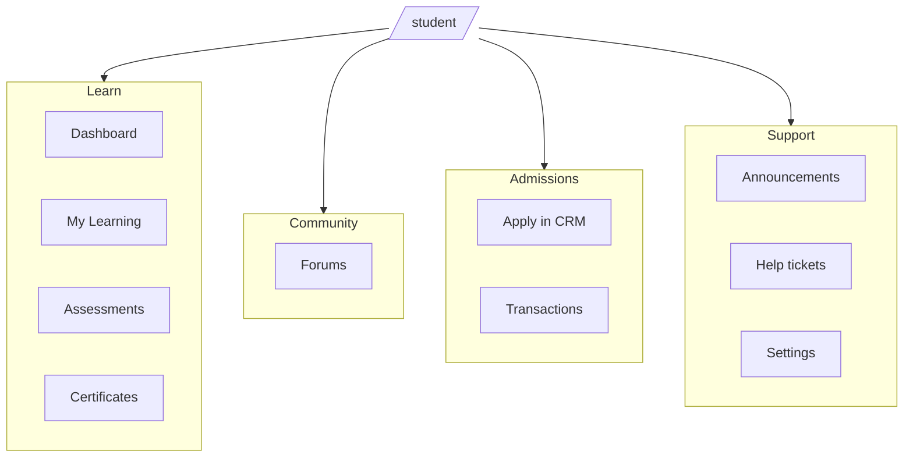

---

## Slide 5 — Discovery → enrollment (overview)

**Three programme types → three flows**

| Type | Examples | Edith role |
|------|----------|------------|
| **Content courses** | YGP, PGP, certificates | Enroll + pay → learn in LMS |
| **Degree programmes** | UG/PG with admissions | Apply in CRM → admit → pay tuition → learn |
| **Personality Profile** | Assessment SKU | Identity → resume → pay → exam → report |

**Flowchart — discovery funnel (three branches)**

```mermaid
flowchart TD
  START([Browse catalogue]) --> PAGE[/courses/slug]
  PAGE --> SIGN{Signed in?}
  SIGN -->|No| LOGIN[Register / Login]
  LOGIN --> CHOOSE
  SIGN -->|Yes| CHOOSE{Programme type?}
  CHOOSE -->|Content course| PATH_A[Path A: Enroll in LMS]
  CHOOSE -->|Degree| PATH_B[Path B: Apply in CRM]
  CHOOSE -->|Personality| PATH_C[Path C: Profile wizard]
  PATH_A --> LEARN[My Learning]
  PATH_B --> LEARN
  PATH_C --> REPORT[Report & recommendations]
```

---

## Slide 6 — Path A: Content courses (YGP / PGP / certs)

**Steps**

1. `/courses/[slug]` — read programme details  
2. `/enroll/[slug]` — pick intake (if any)  
3. **Free** → confirm → **ACTIVE**  
4. **Paid** → `/checkout` → pay → `/payment/success` → **ACTIVE**  
5. Optional: **CRM confirmation** → stays **PENDING** until approved  

**Then:** My Learning → Course hub → Start lessons

**Flowchart — content enrollment**

```mermaid
flowchart TD
  A[/courses/slug] --> B[/enroll/slug]
  B --> C{Price?}
  C -->|Free| D[Confirm enrollment]
  D --> ACTIVE[(ACTIVE)]
  C -->|Paid| E[/checkout]
  E --> F{Payment OK?}
  F -->|Yes| G[/payment/success]
  G --> ACTIVE
  F -->|No| E
  B --> H{CRM gate?}
  H -->|Yes| PEND[(PENDING — CRM)]
  PEND -->|Callback approved| ACTIVE
  ACTIVE --> I[My Learning]
  I --> J[Course hub]
  J --> K[Start lessons]
```

---

## Slide 7 — Path A: Enrollment states (student view)

| State | What the student sees | Next action |
|-------|------------------------|-------------|
| Not enrolled | “Enroll” on course page | Go to enroll |
| **PENDING — payment** | Payment pending panel | Continue to checkout |
| **PENDING — CRM** | Awaiting CRM confirmation | Wait; check My Learning |
| **ACTIVE** | Progress bar + Continue | Open learning outline |
| **COMPLETED** | Full progress / certificate | Review or next course |

**Flowchart — enrollment state machine**

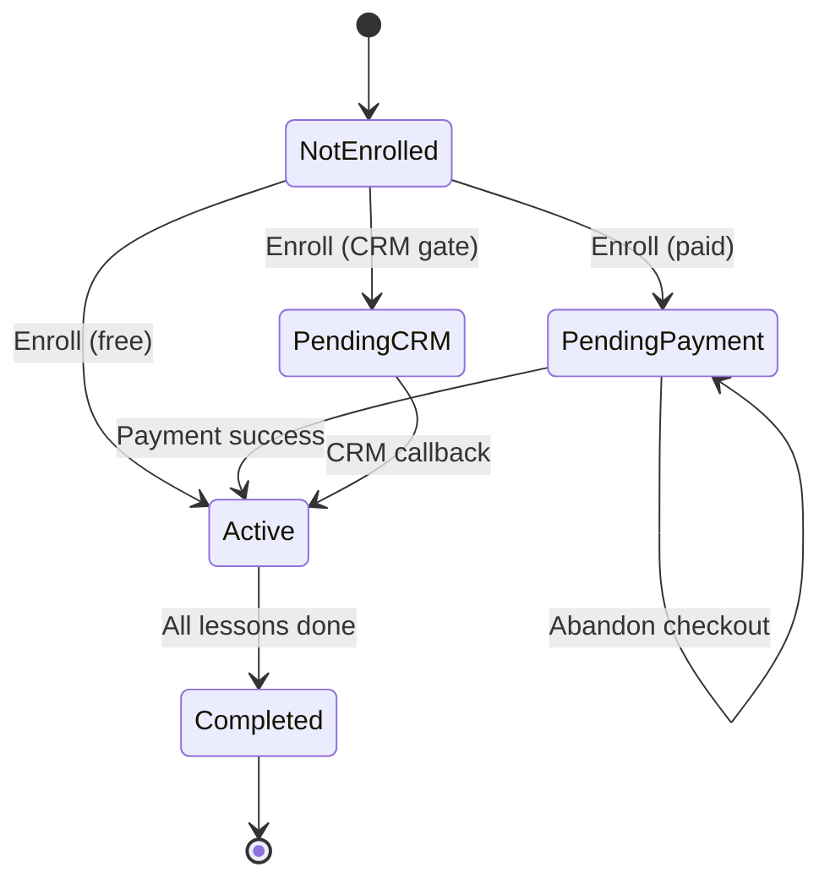

---

## Slide 8 — Path B: Degree programmes (CRM admissions)

**CRM owns application. Edith owns learning after admit.**

1. Course landing → **Apply in CRM**  
2. Student completes application in **CentraCRM**  
3. CRM admits → Edith receives callback → **ACTIVE enrollment**  
4. If tuition unpaid → **Checkout** (blocked until admitted)  
5. Pay → **My Learning** unlocked  

**Edith does not host** the degree application inbox — redirect only.

**Flowchart — CRM ↔ LMS bridge**

```mermaid
flowchart LR
  subgraph Edith
    E1[Course landing]
    E2{Admitted?}
    E3[/checkout]
    E4[My Learning]
  end
  subgraph CentraCRM
    C1[Apply]
    C2[Review & decide]
    C3[Admit]
  end
  E1 -->|Apply in CRM| C1
  C1 --> C2 --> C3
  C3 -->|POST admission-callback| E2
  E2 -->|No| WAIT[Blocked — awaiting admission]
  E2 -->|Yes, unpaid| E3
  E3 -->|Pay tuition| E4
  E2 -->|Yes, paid| E4
```

---

## Slide 9 — Path C: Personality Profile (assessment)

**Standalone 3-step wizard** — `/student/personality-profile`

| Step | Student action | Outcome |
|------|----------------|---------|
| **1 · Identity** | Name, phone, email, address, Aadhaar, PAN | Saved to profile intake |
| **2 · Resume** | Upload PDF/Word | Skills extracted → programme hints |
| **3 · Exam** | Pay ₹3,500 + GST → sit 90 questions | Report, rank, recommendations |

**After exam:** Report page · Rank board · RAG-guided guidance  
**Admin:** Profile intake panel stores contact + resume for staff.

**Flowchart — personality wizard**

```mermaid
flowchart TD
  START([Open Personality Profile]) --> S1[Step 1: Identity]
  S1 --> S2[Step 2: Upload resume]
  S2 --> S3{Exam fee paid?}
  S3 -->|No| PAY[/checkout]
  PAY --> S3
  S3 -->|Yes| EXAM[Step 3: 90-question exam]
  EXAM --> DONE{All questions done?}
  DONE -->|No| EXAM
  DONE -->|Yes| OUT[Report + rank + recommendations]
  S1 -.-> ADMIN[(Admin: Profile intake)]
  S2 -.-> ADMIN
```

---

## Slide 10 — Home base after enrollment

**Where students land day-to-day**

| Screen | Route | Purpose |
|--------|-------|---------|
| **Dashboard** | `/student/dashboard` | Continue learning, recommendations |
| **My Learning** | `/student/my-courses` | All courses + status |
| **Course hub** | `/student/my-courses/[id]` | Progress, assessments, continue |
| **Browse** | `/student/enroll` | Enroll in more programmes |
| **For you** | `/student/recommendations` | History + resume-based suggestions |

**Flowchart — daily navigation**

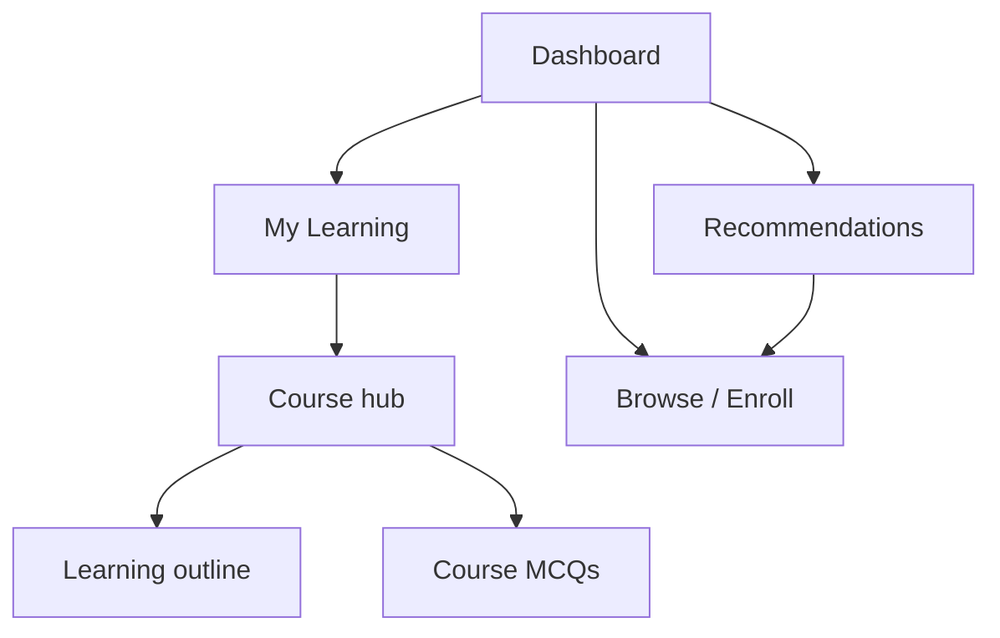

---

## Slide 11 — Learning loop (core LMS)

**Lesson player** (`/student/learning/.../lessons/...`)

- Video · PDF · Rich text · External link  
- Mark complete (or auto on video end)  
- Optional **lesson quiz** (randomized MCQ)  
- Optional **AI tutor chat**  
- Previous / next navigation  

**Certificate:** Issued when all published lessons are complete.

**Flowchart — learning loop**

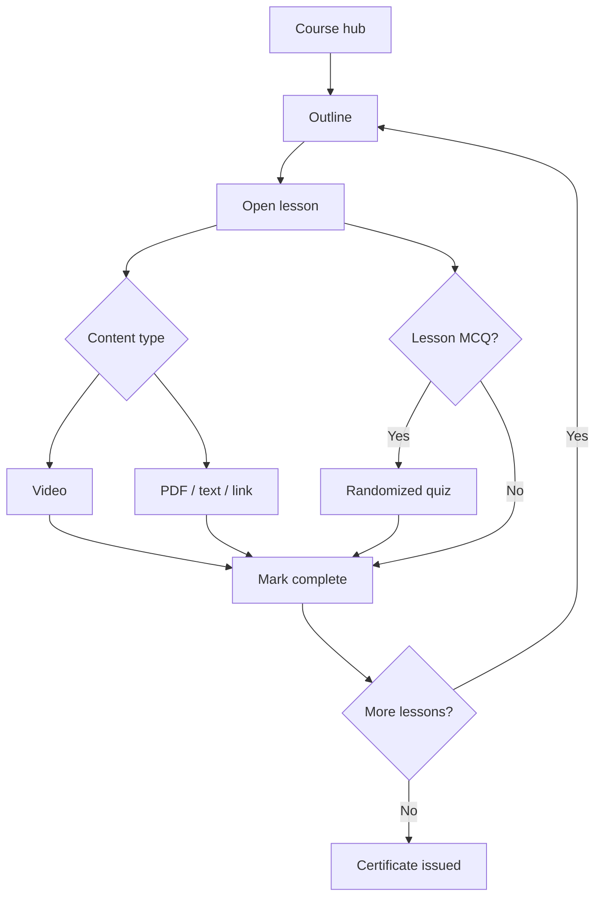

---

## Slide 12 — Assessments hub

**Single entry:** `/student/assessments`

| Type | Where | Experience |
|------|-------|------------|
| Personality Profile | Always visible | KYC + exam progress |
| Assignments | Per course | Text submit → submissions history |
| Quizzes | Per course | MCQ, scored on submit |
| **Course MCQs** | Course hub / assessments | Random question bank per attempt |
| **Lesson MCQs** | Inside lesson / outline badge | All bank questions, shuffled |

**Flowchart — assessments hub (spoke model)**

```mermaid
flowchart TD
  HUB[/student/assessments]
  HUB --> PP[Personality Profile]
  HUB --> ASGN[Assignments]
  HUB --> QUIZ[Course quizzes]
  HUB --> CMCQ[Course MCQs]
  CMCQ --> BANK1[Random paper per attempt]
  LESSON[Lesson player] --> LMCQ[Lesson MCQs]
  LMCQ --> BANK2[Shuffled bank]
  PP --> KYC[Identity + resume]
  PP --> EXAM[90-question exam]
```

---

## Slide 13 — Payments & transactions

**Routes:** `/checkout` · `/student/transactions` · invoice pages

| Scenario | Student action |
|----------|----------------|
| New paid course | Checkout from enroll |
| Resume payment | My Learning or Transactions |
| Degree tuition | Checkout after CRM admission |
| Personality exam fee | Checkout before exam unlock |
| Installments | Pay partial plans on Transactions |

**Flowchart — payment paths**

```mermaid
flowchart TD
  subgraph Triggers
    T1[New paid course]
    T2[Resume payment]
    T3[Degree tuition]
    T4[Personality exam]
    T5[Installment due]
  end
  T1 --> CHK[/checkout]
  T2 --> CHK
  T3 --> CHK
  T4 --> CHK
  T5 --> TX[/student/transactions]
  CHK --> STRIPE{Payment provider}
  STRIPE -->|Success| OK[/payment/success]
  STRIPE -->|Fail| CHK
  OK --> UNLOCK[Unlock course / exam]
  TX --> INV[Invoice PDF]
  CHK --> INV
```

---

## Slide 14 — Community & support

| Need | Route |
|------|-------|
| Discuss with cohort | Forums → thread → reply |
| Institute messages | Announcements |
| Get help | Help tickets |
| Alerts | Notifications |

**Flowchart — support & community**

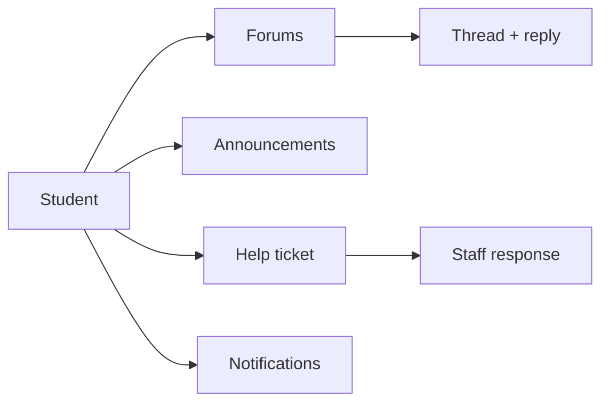

---

## Slide 15 — Outcomes & profile

| Outcome | Route |
|---------|-------|
| Course certificate | Certificates (print) |
| Personality report | Personality Profile → report |
| Rank board | Personality Profile → rank |
| Badges gallery | Badges |
| Learning stats | Progress · Achievements |
| Account | Profile · Settings (password) |

**Flowchart — outcomes**

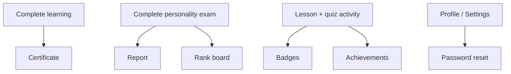

---

## Slide 16 — Happy path (content student)

**One sentence per step — ideal demo script**

1. Register on Edith  
2. Browse catalogue → open a YGP/PGP course  
3. Enroll → checkout → payment success  
4. Dashboard → **My Learning** → **Continue**  
5. Complete lessons on the outline  
6. Optional: lesson quiz + course MCQ + assignments  
7. All lessons done → **certificate**  
8. Recommendations suggest the next programme  

*~15–20 minutes in a live walkthrough*

**Flowchart — happy path (demo timeline)**

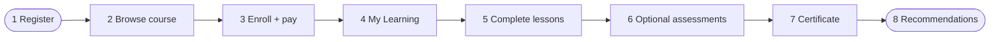

---

## Slide 17 — Decision guide (for trainers & sales)

| Student goal | Send them to |
|--------------|--------------|
| Short paid course | Course page → Enroll → Checkout |
| Degree | Course page → **Apply in CRM** |
| Career assessment | **Personality Profile** |
| Continue learning | **Dashboard** or **My Learning** |
| Pay outstanding fee | **Transactions** |
| All coursework | **Assessments** |

**Flowchart — routing decisions**

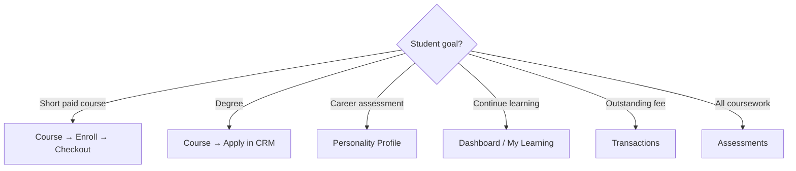

---

## Slide 18 — System boundaries (one slide for stakeholders)

**In Edith LMS**  
Learning · payments (tuition) · assessments · certificates · intake data (personality)

**In CentraCRM**  
Degree applications · admission decisions · application fees (typical)

**Bridge**  
Admission callback → ACTIVE enrollment · Enrollment callback for CRM-gated short courses

**Flowchart — system boundaries**

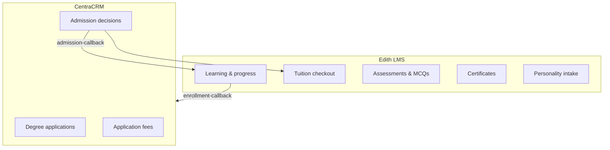

---

## Slide 19 — Summary

- **One student workspace** with clear Learn / Admissions / Support groups  
- **Three enrollment paths** — content, degree, personality  
- **One learning loop** — outline → lessons → complete → certify  
- **Assessments** centralized + MCQs at course and lesson level  
- **CRM + LMS** split keeps degrees clean; content courses stay fast  

**Flowchart — end-to-end (condensed)**

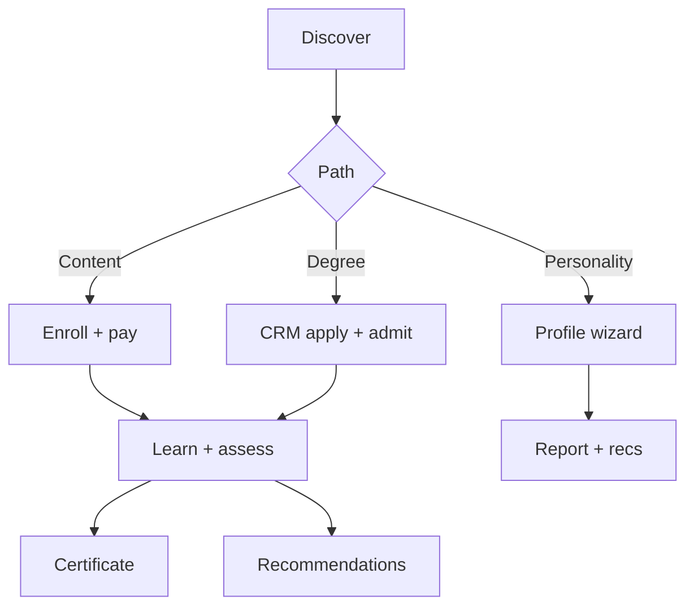

---

## Slide 20 — Thank you

**Questions?**

Demo environments: marketing site + `/student/dashboard`  
Docs: `FEATURES.md` · this deck outline  

---

## Appendix A — Export flowcharts to PowerPoint

1. Open [mermaid.live](https://mermaid.live)  
2. Paste the `mermaid` block from any slide  
3. **Actions → PNG** or **SVG** (SVG scales better)  
4. Insert image on the slide beside bullet text  

**Theme tip:** In Mermaid Live, use *Configuration → theme: neutral* for print-friendly slides.

---

## Appendix B — Slide ↔ flowchart index

| Slide | Flowchart title |
|-------|-----------------|
| 3 | Platform entry |
| 4 | Workspace map |
| 5 | Discovery funnel (three branches) |
| 6 | Content enrollment |
| 7 | Enrollment state machine |
| 8 | CRM ↔ LMS bridge |
| 9 | Personality wizard |
| 10 | Daily navigation |
| 11 | Learning loop |
| 12 | Assessments hub |
| 13 | Payment paths |
| 14 | Community & support |
| 15 | Outcomes |
| 16 | Happy path timeline |
| 17 | Routing decisions |
| 18 | System boundaries |
| 19 | End-to-end condensed |

---

*Presenter tip: Use **Slide 5** as the anchor diagram; return to it when the audience asks “what about degrees?” or “what about the assessment?”*

---

# Part B — Content Upload Flow (Admin → Student)

How staff upload programme content and when students can see it. Copy each slide block into PowerPoint; export Mermaid charts via [mermaid.live](https://mermaid.live).

---

## Slide C1 — Content upload overview

**Three content pipelines in Edith**

| Pipeline | Admin entry | What gets uploaded |
|----------|-------------|-------------------|
| **Programme & syllabus** | `/admin/programs` · `/admin/syllabus/[programId]` | Title, image, modules, lessons |
| **Lesson media** | Syllabus editor (per lesson) | PDF, video file, YouTube URL, markdown, external link |
| **Assessments (MCQs)** | `/admin/course-mcqs` · `/admin/lesson-mcqs` | Questions manually or via JSON import |

**Rule of thumb:** Saving writes to DB/disk immediately. **Publishing** is a separate step that unlocks the student view.

**Flowchart — three pipelines**

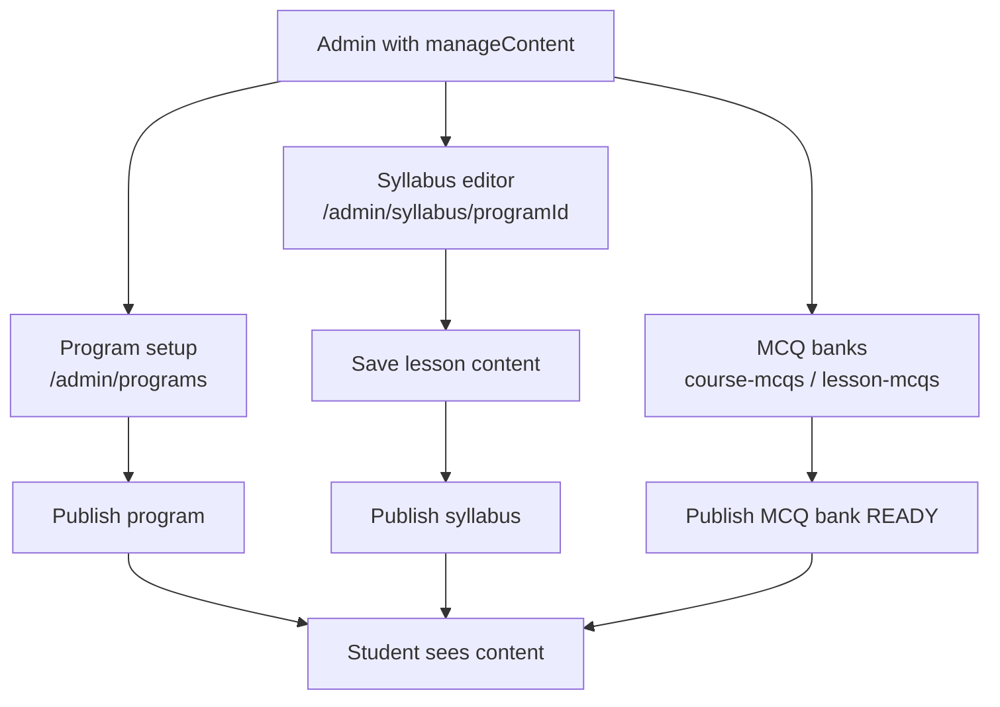

---

## Slide C2 — Three publish gates

Students only see content when **all relevant gates** pass.

| Gate | Where set | Unlocks |
|------|-----------|---------|
| **Program PUBLISHED** | Program detail page | Marketing `/courses/[slug]`, enrollment |
| **Syllabus PUBLISHED** | Syllabus editor | Learning routes `/student/learning/...` |
| **Lesson visible** | Per-lesson checkbox (`isPublished`) | Lesson appears in outline |
| **MCQ READY + active** | MCQ detail → Publish | Quiz links on course hub / lesson page |

**Also required:** student enrollment **ACTIVE** (or COMPLETED for some assessments).

**Flowchart — publish gates**

```mermaid
flowchart LR
  subgraph Gates
    G1[Program PUBLISHED]
    G2[Syllabus PUBLISHED]
    G3[Lesson isPublished]
    G4[MCQ status READY]
    G5[Enrollment ACTIVE]
  end

  G1 --> MKT[/courses/slug]
  G2 --> LEARN[/student/learning]
  G3 --> LESSON[Lesson in outline]
  G4 --> QUIZ[Quiz available]
  G5 --> LEARN

  G1 -.->|catalog| G5
  G2 -.->|learning| G3
```

---

## Slide C3 — Lesson content upload (by type)

**Admin:** `/admin/syllabus/[programId]` → Syllabus editor → create module → create/edit lesson

| Content type | Admin input | Stored where | DB field |
|--------------|-------------|--------------|----------|
| **Rich text** | Markdown textarea | PostgreSQL only | `content` + `RICH_TEXT` |
| **Video URL** | YouTube / Vimeo link | PostgreSQL only | `content` + `VIDEO_URL` |
| **Private video** | File upload (≤ 200 MB) | `uploads/private/{uuid}/file.mp4` | storage path + `VIDEO_URL` |
| **PDF** | File upload (≤ 25 MB) | `uploads/private/{uuid}/file.pdf` | storage path + `PDF_FILE` |
| **External link** | URL | PostgreSQL only | `content` + `EXTERNAL_LINK` |

**Server action:** `lib/actions/syllabus.ts` → `lessonContentFromForm()` → `saveLessonPdf` / `saveLessonVideo` in `lib/storage.ts`

**Flowchart — lesson save path**

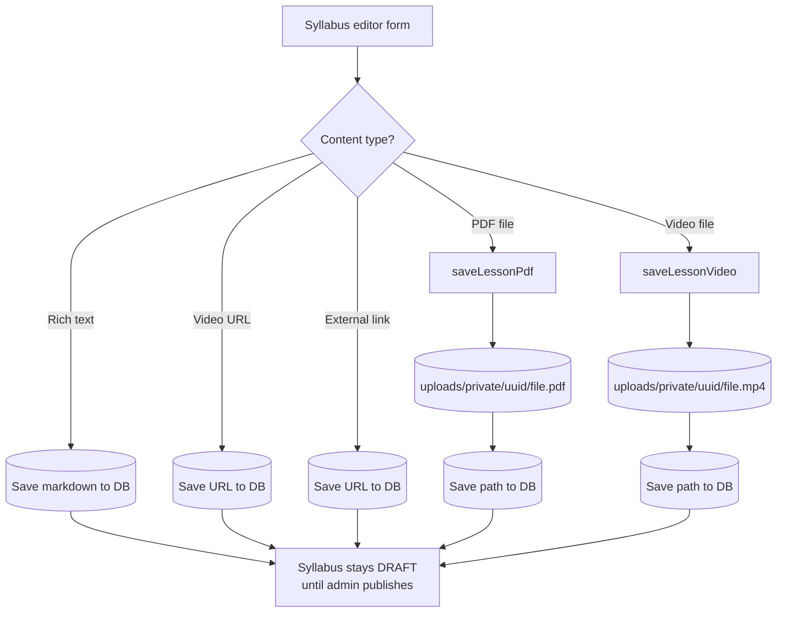

---

## Slide C4 — Storage & serving

**Filesystem layout**

```
uploads/
  public/{uuid}/image.jpg     ← programme hero image (≤ 5 MB)
  private/{uuid}/lesson.pdf   ← lesson PDF (≤ 25 MB)
  private/{uuid}/lecture.mp4  ← lesson video (≤ 200 MB)
```

**URL helper:** `uploadUrl(path)` → `/api/uploads/{path}`

| Asset | Visibility | Student delivery |
|-------|------------|-------------------|
| Programme image | Public | Course landing page |
| Lesson PDF | Private | iframe + download on lesson page |
| Lesson video file | Private | `<video>` player on lesson page |
| YouTube/Vimeo URL | Public embed | iframe (no upload) |

**Flowchart — upload → serve**

```mermaid
flowchart LR
  UP[Admin file upload] --> WRITE[writeUpload<br/>uploads/kind/uuid/name]
  WRITE --> DB[DB: storage path in SyllabusLesson.content]
  DB --> URL[uploadUrl → /api/uploads/path]
  URL --> LESSON[Student lesson page]

  YT[YouTube URL pasted] --> DB2[DB: URL string]
  DB2 --> EMBED[parseLessonVideo → iframe]
  EMBED --> LESSON
```

---

## Slide C5 — Syllabus publish (manual step)

Saving a lesson **does not** publish the syllabus. Admin must click **Publish**.

**Checks before publish:**
- At least one module (section)
- At least one lesson marked **Visible to enrolled students**

**After publish:** `ProgramSyllabus.status = PUBLISHED` → students with ACTIVE enrollment can open `/student/learning/[course-id]`.

**YGP/PGP simple mode:** new lessons auto-set `isPublished = true` on save (still need syllabus publish).

**Flowchart — admin publish sequence**

```mermaid
flowchart TD
  A1[Create program DRAFT] --> A2[Build modules + lessons]
  A2 --> A3[Upload content per lesson]
  A3 --> A4{Ready for students?}
  A4 -->|No| A3
  A4 -->|Yes| A5[Publish syllabus]
  A5 --> A6[Publish program]
  A6 --> LIVE[Catalog + learning live]
```

---

## Slide C6 — MCQ content upload

**Two admin areas**

| Type | Route | Scope |
|------|-------|-------|
| **Course MCQ** | `/admin/course-mcqs/[id]` | Whole programme — random paper per attempt |
| **Lesson MCQ** | `/admin/lesson-mcqs/[id]` | One quiz per published lesson |

**Ways to add questions**
1. **Manual** — form per question → bank status → `PENDING`
2. **JSON import** — paste bulk JSON → `importMcqQuestionsFromJson`

**Publish:** Admin clicks **Publish** → `status = READY`, `isActive = true`

**JSON import rules**

| Action | Bank was READY? | Result |
|--------|-----------------|--------|
| Append questions | Yes | Stays **READY** — live immediately |
| Append questions | No (PENDING) | Stays **PENDING** — must publish |
| Replace entire bank | Any | Back to **PENDING** — must republish |

**Flowchart — MCQ upload & publish**

```mermaid
flowchart TD
  START[Create MCQ bank] --> ADD{Add questions}
  ADD -->|Manual form| PEND[status = PENDING]
  ADD -->|JSON import| IMP{Replace bank?}

  IMP -->|Yes| PEND
  IMP -->|No, append| W{Was READY?}
  W -->|Yes| LIVE[Stays READY — live now]
  W -->|No| PEND

  PEND --> PUB[Admin clicks Publish]
  PUB --> READY[status = READY]
  READY --> STU[Student quiz routes]
  LIVE --> STU
```

---

## Slide C7 — Program & catalog setup

**Admin UI:** `/admin/programs` → create/edit → upload hero image → publish

| Step | Action | Result |
|------|--------|--------|
| 1 | Create programme | `status = DRAFT` |
| 2 | Upload image | `saveProgramImage` → `uploads/public/...` |
| 3 | Attach syllabus | `/admin/syllabus/[programId]` |
| 4 | Publish programme | Visible on `/courses` catalogue |

**Ops / seed alternative:** `npx tsx prisma/publish-catalog.ts` reads `catalog-data.ts` and creates fully published programmes with YouTube lesson URLs (no file uploads).

**Flowchart — programme to catalogue**

```mermaid
flowchart LR
  CREATE[Create program] --> IMG[Upload hero image]
  IMG --> SYL[Build syllabus]
  SYL --> PUBS[Publish syllabus]
  PUBS --> PUBP[Publish program]
  PUBP --> CAT[/courses + /courses/slug]
  CAT --> ENR[Student enrolls]
  ENR --> LEARN[/student/learning]
```

---

## Slide C8 — End-to-end: upload → student view

**Full path for a PDF lesson**

1. Admin uploads PDF in syllabus editor  
2. File saved to `uploads/private/{uuid}/notes.pdf`  
3. Path stored in `SyllabusLesson.content`  
4. Admin publishes syllabus + program  
5. Student enrolls → ACTIVE  
6. Opens `/student/learning/.../lessons/...`  
7. Page renders PDF via `/api/uploads/private/...`  

**Full path for YouTube lesson**

1. Admin pastes YouTube URL (no file upload)  
2. URL stored in DB  
3. Same publish + enroll gates  
4. `LessonVideo` embeds iframe — plays directly from YouTube  

**Flowchart — end-to-end delivery**

```mermaid
flowchart TB
  subgraph Admin
    U1[Upload / paste content]
    U2[Save lesson]
    U3[Publish syllabus + program]
  end

  subgraph Storage
    FS[(uploads/private or public)]
    PG[(PostgreSQL SyllabusLesson)]
  end

  subgraph Student
    E[Enroll ACTIVE]
    H[Course hub]
    L[Lesson player]
    R{contentType}
    R --> RT[Markdown]
    R --> V[Video embed / file]
    R --> PDF[PDF iframe]
  end

  U1 --> U2
  U2 --> FS
  U2 --> PG
  U3 --> E
  E --> H --> L --> R
  FS --> V
  FS --> PDF
  PG --> L
```

---

## Appendix C — Content upload slide index

| Slide | Flowchart title |
|-------|-----------------|
| C1 | Three content pipelines |
| C2 | Publish gates |
| C3 | Lesson save by type |
| C4 | Storage & serving |
| C5 | Admin publish sequence |
| C6 | MCQ upload & publish |
| C7 | Programme to catalogue |
| C8 | End-to-end delivery |

**Key files:** `lib/storage.ts` · `lib/actions/syllabus.ts` · `components/admin/syllabus-editor.tsx` · `lib/actions/admin-course-mcq.ts` · `lib/assessments/mcq-import.ts` · `prisma/publish-catalog.ts`
